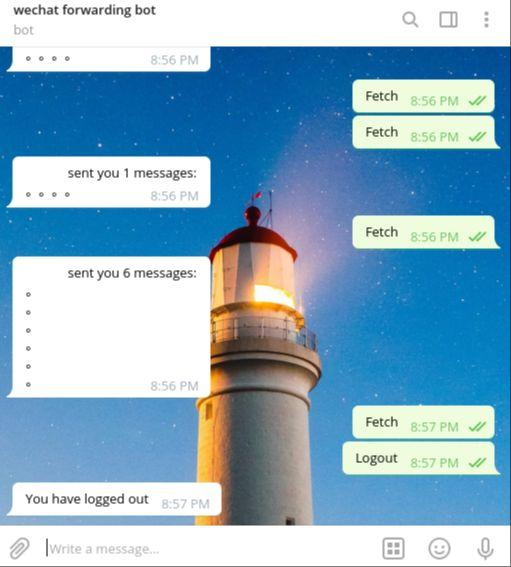
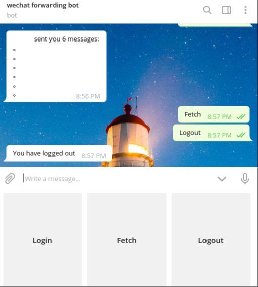

# wechat-telegram-forwarding-bot

## 部署
1. 你需要一个Telegram帐号，一个Telegram Bot https://core.telegram.org/bots ,并拥有Bot的Token
2. 你处于中立边界，也就是这个Bot的运行网路下你能够访问微信与Telegram
3. 安装依赖，`sh install.sh`
4. 在文件夹内新建一个token.txt，复制token进去,请勿换行
5. 运行`python3 main.py` 或 `python3 streaming.py`

前者效果如下图，需要扫二维码Login并手动Fetch消息

后者以强制push消息但不提供登出，请在运行机器上手动结束程序,效果如下

## 已知Bug
没有肉眼可见的bug

## 免责声明
协议请见Licence，本程序基于Web微信,本人对使用本程序产生的所有后果不负任何责任