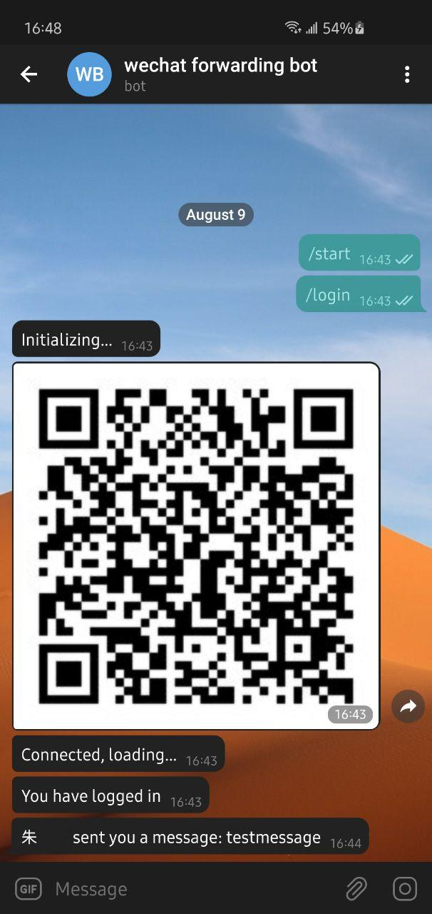

# wechat-telegram-forwarding-bot

## 部署
1. 你需要一个Telegram帐号，一个Telegram Bot https://core.telegram.org/bots ,并拥有Bot的Token
2. 你处于中立边界，也就是这个Bot的运行网路下你能够访问微信与Telegram
3. 安装依赖，`sh install.sh`
4. 在文件夹内新建一个token.txt，复制token进去,请勿换行
5. 运行`python3 main.py`
6. 使用/login 与 /logout命令登入登出  

效果如下图,本次更新解决了需要手动Fetch消息的问题，每十秒自动推送  

## 已知Bug
没有肉眼可见的bug

## 特别鸣谢
本程序由Nagato 与 Sida共同完成,尤其在解决Fetch与chrome的支持上需要特别感谢Sida

## 免责声明
协议请见Licence，本程序基于Web微信,本人对使用本程序产生的所有后果不负任何责任