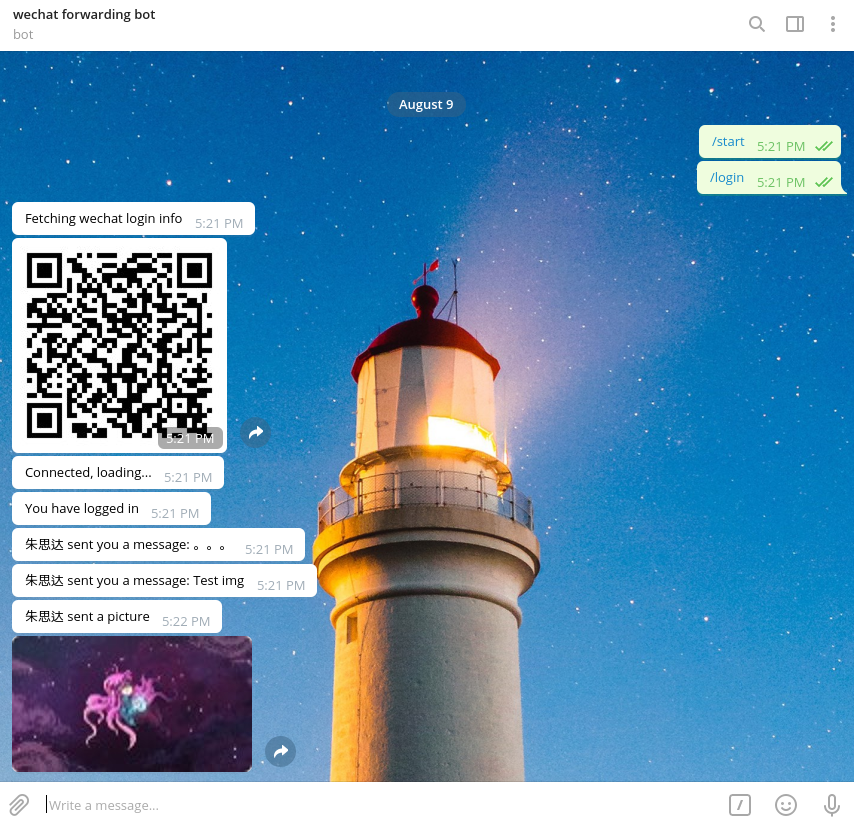

# wechat-telegram-forwarding-bot

## 部署
1. 你需要一个Telegram帐号，一个Telegram Bot https://core.telegram.org/bots ,并拥有Bot的Token
2. 你处于中立边界，也就是这个Bot的运行网路下你能够访问微信与Telegram
3. 安装依赖，`sh install.sh`
4. 在文件夹内新建一个config.txt，复制token进去,成为第一行，第二行为你的Telegram username，不需要at
例如:
```
186256385:hjibbhiuhgYGYUgvFFTY
botfather
```
5. 运行`python3 main.py`
6. 打开Bot,使用/login 与 /logout命令登入登出

效果如下图,本次更新解决了需要手动Fetch消息的问题，每十秒自动推送  

  

## 已知Bug
1. 在不稳定网络中运行中可能出现掉线后logout后无法login的问题

## 特别鸣谢
本程序由Nagato 与 Sida共同完成,特别感谢Sida在解决Fetch与chrome的支持（在Chrome版本的上有远超Gecko版的体验与中文支持）

## 免责声明
协议请见Licence，本程序基于Web微信,本人对使用本程序产生的所有后果不负任何责任
